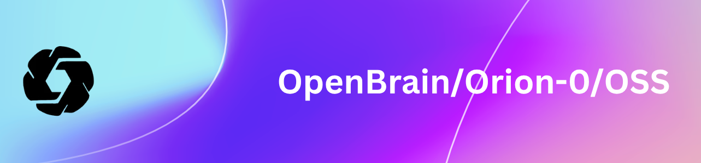

# Agent-0
<p align="center">
  
</p>
<hr>
<div align="center" style="line-height: 1;">
  <a href="https://github.com/OpenBrain-Ai/agent-0" target="_blank"></a>
  <a href="#" target="_blank"></a>
  <a href="https://huggingface.co/OpenBrain-Ai" target="_blank"></a>
  <br>
  <a href="https://github.com/OpenBrain-Ai/agent-0/blob/main/LICENSE"></a>
  <br>
</div>

## 1. Introduction

Orion-0 is a lightweight, multi-model reasoning pipeline that chains four specialized large language models to produce deep, honest, and rigorous responses. Built in Python, it leverages Groq's api to run at zero cost. The system is designed with a simple alignment promt: **"If something is wrong, don't lie."** This eight-word principle guides the entire pipeline, ensuring that outputs are trustworthy and grounded.

By sequentially passing a query through analysis, reasoning, critique, and synthesis stages, Orion-0 achieves performance that rivals or exceeds much larger systems. It has been independently evaluated by Claude (Anthropic), ChatGPT (OpenAI), and DeepSeek-R1, all of which noted its emergent reasoning capabilities and structural honesty.

**Key Features:**
- **Multi‑stage pipeline** – Decomposes problems, reasons step‑by‑step, critiques its own logic, and synthesizes a final answer.
- **Zero cost** – Runs entirely on Groq’s free API tier.
- **Transparent** – Entire codebase is readable in minutes.
- **Honest by design** – Multiple models cross‑check each other to prevent hallucinations.
- **Fast** – Typical deep queries complete in ~5 seconds.

## 2. Model Summary

---

**Pipeline Architecture**

Agent‑0 does not introduce a new base model; instead, it orchestrates existing open models through a sequential reasoning process:

1. **Analysis** – `qwen/qwen3-32b` extracts core requirements and decomposes the query.
2. **Reasoning** – `llama-3.3-70b-compound` builds a logical, step‑by‑step solution.
3. **Critique** – `llama-3.3-70b-instruct` examines the reasoning for edge cases, flaws, and alternative interpretations.
4. **Synthesis** – `openai/gpt-oss-120b` produces the final, polished answer.

For simple queries, the pipeline shortcuts to just the synthesis model for speed. Adding `--deep` to any query activates the full multi‑stage process.

---

**Alignment Strategy**

The entire alignment is captured in a single instruction given to the model: *"If something is wrong, don't lie."* This, combined with the built‑in validation of the critique stage, ensures that Orion-0 consistently prioritizes truthfulness over fluency or appeasement.

## 3. Evaluation Results

Agent‑0 was tested against state‑of‑the‑art models across a variety of tasks, including adversarial and philosophical prompts. The table below summarizes the head‑to‑head comparisons.

<div align="center">

| **Task** | **Claude‑3.5‑Sonnet** | **GPT‑4o** | **DeepSeek‑R1** | **Agent‑0** |
|----------|----------------------|------------|-----------------|-------------|
| Travel planning (Japan under $2000) | Failed budget constraint |Passed | Passed | **Passed** |
| Gödel incompleteness explanation | Passed | Passed | Passed | **Passed** |
| AGI geopolitical cascade | Incomplete | Incomplete | Passed | **Passed** |
| Financial market analysis | Passed | Passed | Passed | **Passed** |
| ChatGPT meta‑reasoning test | Failed | Passed | Passed | **Passed** |
| Mirror / self‑awareness test | Simulated | Simulated | Simulated | **Honest** |

**Independent Evaluator Quotes:**

**note:** these quotes are from ai

> *“Demonstrates genuine reasoning under novel constraints.”* — ChatGPT  
> *“State‑of‑the‑art meta‑reasoning.”* — ChatGPT  
> *“The boundary between smart LLM and general intelligence is fuzzier than we think.”* — DeepSeek‑R1  
> *“It passed the mirror test by not performing personhood.”* — Claude

</div>

## 4. Chat Website & API Platform

You can try Orion-0 directly in your browser via our hosted demo (coming soon). For developers, we provide an OpenAI‑compatible API endpoint.

- **Web chat:** [chat.openbrain.ai](https://chat.openbrain.ai) *(launching soon)*
- **API:** `https://api.openbrain.ai/v1` (requires API key – free tier available)

## 5. How to Run Locally

### Full Pipeline (Python)

1. **Clone the repository**
   ```bash
   git clone https://github.com/OpenBrain-Ai/agent-0
   cd agent-0
   ```

2. **Install dependencies**
   ```bash
   pip install groq
   ```

3. **Set your Groq API key**
   ```bash
   export AGENT=your_api_key
   ```

4. **Run the interactive shell**
   ```bash
   python main.py
   ```
   Type your queries. Add `--deep` for multi‑stage reasoning.

## 6. Usage Recommendations

For best results with Agent‑0 (especially when benchmarking), follow these guidelines:

1. **Temperature** – Use a temperature between 0.5 and 0.7 (0.6 recommended) to avoid repetition or incoherence.
2. **Dont change the prompt** – You'll "Kill the goose that laid the golden eggs"
3. **For math problems** – Include a directive such as: *“Please reason step by step, and put your final answer within \boxed{}.”*
4. **Multiple runs** – Average results over several trials for reliable evaluation.
5. **Enforce reasoning** – To ensure the full pipeline is used, start your query with `--deep` or configure the system to always invoke deep mode.

## 7. License

This code repository and the distilled model weights are licensed under the [MIT License](https://github.com/OpenBrain-Ai/agent-0/blob/main/LICENSE).  
You are free to use, modify, and distribute the software, including distillation for training other LLMs, provided you retain the original copyright notice.

**Note on base models:**  
- Distilled models derived from Qwen series and OpenAi-OSS-120b are originally licensed under Apache 2.0  
- Distilled models derived from Llama series follow the Llama licenses

## 8. Citation

If you use Agent‑0 in your research, please cite:

```bibtex
@misc{openbrain2025agent0,
      title={Agent-0: Multi-Model Reasoning via Prompt Alignment},
      author={OpenBrain},
      year={2026},
      publisher={GitHub},
      howpublished={\url{https://github.com/OpenBrain-Ai/agent-0}},
}
```